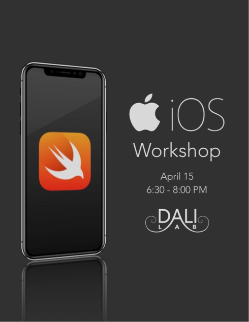
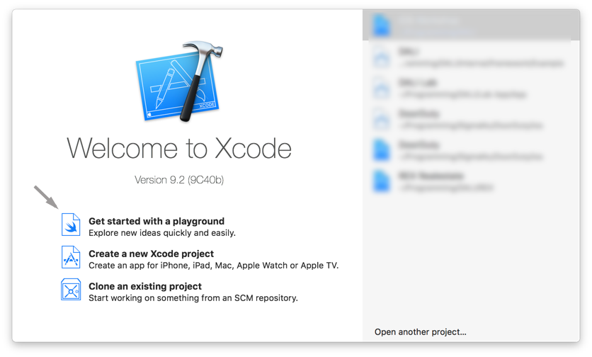

# iOS Workshop
Learn how to develop your very own apps in iOS in the young but powerful language Swift

## Getting Started
Lets get started!

## Part 0: Install [Xcode](https://itunes.apple.com/us/app/xcode/id497799835?mt=12)

Once the app is installed, open and install tools if prompted.

## Part 1: Swift

In the Xcode start window select "Get started with a playground".

This will allow us to experiment with Swift syntax outside the context of an application. Explore the language, and take a look at [this](https://itunes.apple.com/us/book/the-swift-programming-language-swift-4-0-3/id881256329?mt=11) resource for a quick introduction to Swift.

## Part 2: iOS App dev

### Step 1: Get the starter code
Click the clone or download button. Click the "Open in Xcode" button and this will open it right in Xcode. If you are not using Safari or it doesn't show up, download zip file, unzip, and open "iOS Workshop.xcodeproj".

### Step 2: Your'e ready!
iOS development is very handy in that it requires little to no configuration to get started, even on an existing project.

### Follow the video
The rest of the stuff we are gonna do is live in the workshop. Watch the video of it and follow along (not yet posted)