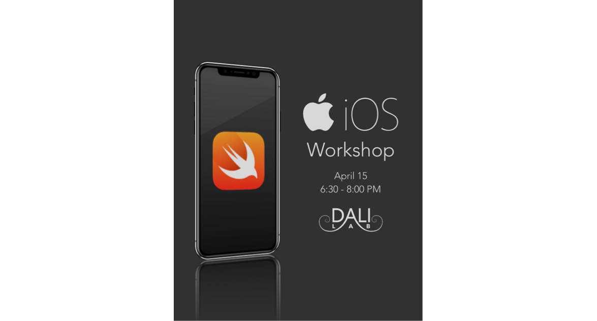
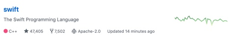

# iOS Workshop
Learn how to develop your very own apps in iOS in the young but powerful language Swift

## Getting Started
Lets get started! This section will get you downloading Xcode, getting the code, and installing the neccessary packages.

## Part 0: Install [Xcode 🔨](https://itunes.apple.com/us/app/xcode/id497799835?mt=12)

Xcode is the development environment for all iOS, MacOS, tvOS, watchOS projects, including applications, installers, extensions, etc.
It can be a little complicated, but it is an incredibly powerful tool and designed by developers like you. 

1. Download and install Xcode
2. Open the app (in your Applications) and wait for it to install tools

## Part 1: Swift ⭐️

Swift is an awesome language. First released in 2014, Swift has been cleaned, designed, tested, and optimized 5 times by developers
at Apple and by independent contributors. Swift became a open-source language soon after its release, and is now being actively developed
by regular developers who want to see the language they use to improve.

### 1. In the Xcode start window select "Get started with a playground".

This will allow you to experiment with Swift syntax outside the context of an application. A palyground is a great place to just try things out and quickly see what is happening in Swift. Code your algorithms, test your UI code, or just experiment with iOS libraries you are unfamiliar with.

### 2. Experiment with Swift
Explore the language

> Take a look at **[the Swift Programming Language book](https://itunes.apple.com/us/book/the-swift-programming-language-swift-4-0-3/id881256329?mt=11)** resource for a quick introduction to Swift.

## Part 2: iOS App dev 📱

### Step 1: Get the starter code

Click the *Clone or download* button. Click the *Open in Xcode* button and this will open it right in Xcode.

#### NOTE: If you are not using Safari or the button doesn't show:
Just download the zip using the *Download Zip* button and unzip it.

### Step 2: Install Pods

Cocoapods is a package manager for Xcode projects, and it is quite easy to use. 

1. Run `pod install` in your prefered terminal to install all the packages
2. Open "DALI Yak.xcworkspace" where the cocoapods are installed

### Step 3: Build and Run
1. Click the section to the right the "DALI Yak" text in the top left of the Xcode window

2. Select the destination device in Xcode in at the top left to the device you want to run on. 

3. Build and run the project: ⌘R (menu bar: Product > Run)

# Learning Resources
* [The Swift Programming Language book](https://itunes.apple.com/us/book/the-swift-programming-language-swift-4-0-3/id881256329?mt=11): A very well written and simple introduction to a simple language
* [Jump Right In: Start Developing iOS Apps](https://developer.apple.com/library/archive/referencelibrary/GettingStarted/DevelopiOSAppsSwift/): Apple's awesome starter tutorial on basics in iOS development
